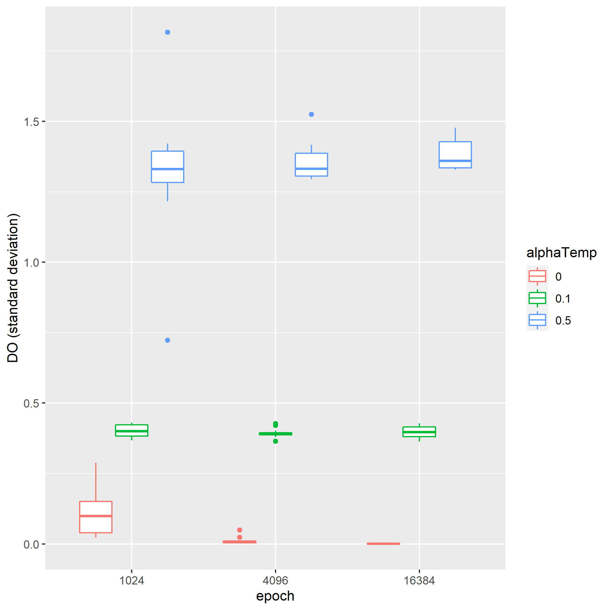

# 5W1H

- when: 2020-12-18
- where: work020
- why: to examine if, with the larger temperature parameter: alpha, the entropic regularization works for better exploration.
- what: the fact that trained agents have the larger standard deviation of disturbance factor with the larger temerature parameter
, while PV meets with the target for all the trained agents.
- how: illustrate learning curves of agents trained with various temperature paramters

# Setting

## hyperparameter

```
plantClasses = ["ConcretePlant003",]
plantClass = plantClasses[int(np.random.randint(len(plantClasses)))]

policyClasses = ["ConcretePolicy001",]
policyClass = policyClasses[int(np.random.randint(len(policyClasses)))]

nQfunctionRedundancy = int(np.random.choice([2,]))

nBatch = 2**5
nStepGradient = 1
learningRateForUpdatePolicy = float(np.random.choice([1e-2,]))/nStepGradient
learningRateForUpdateActionValueFunction = float(np.random.choice([1e-2,]))/nStepGradient
learningRateForUpdateStateValueFunction = float(np.random.choice([1e-3,]))/nStepGradient
alphaTemp = float(np.random.choice([0., 0.1, 0.5,]))
weightOnMv = float(np.random.choice([0.5,]))
	
yield ConcreteBuildParameter(nIntervalSave = nEpoch//(2**4)
					, nEpoch = nEpoch
					, label = self.workName
					, plantClass = plantClass
					, discountFactor = float(np.random.choice([0.99,])) # Q(s,a) = (1-gamma) * reward(s,a) + gamma * V(s+)
					, alphaTemp = alphaTemp
					, saveFolderPathAgent = self.saveFolderPathAgent
					, nFeature = 1
					, nSampleOfActionsInValueFunctionApproximator = int(np.random.choice([2**0,]))
					, nHiddenValueFunctionApproximator = 2**5
					, nStepEnvironment = 1
					, nStepGradient = nStepGradient
					, nIntervalUpdateStateValueFunction = int(np.random.choice([2**0,]))
					, nIterationPerEpoch = 1
					, bufferSizeReplayBuffer = int(np.random.choice([2**16,]))
					, featureExtractorClass = "ConcreteFeatureExtractor002"
					, learningRateForUpdateActionValueFunction = learningRateForUpdateActionValueFunction 
					, learningRateForUpdatePolicy = learningRateForUpdatePolicy
					, learningRateForUpdateStateValueFunction = learningRateForUpdateStateValueFunction
					, policyClass = policyClass
					, replayBufferClass = "ConcreteReplayBuffer001"
					, nBatch = nBatch
					, nQfunctionRedundancy = nQfunctionRedundancy
					, valueFunctionApproximatorClass = "ConcreteValueFunctionApproximator002"
					, weightOnMv = weightOnMv)
```

# Results

## NH4(average)

- At the end of the training iteration, all the agents have met with the SV of NH4, 3.


## DO(average)

- The values of DO of all the trained agents distribute around the similar value.


## DO(Standard deviation)

- With the larger temperature parameter, `alpha`, the larger the trained standard deviation of agents' disturbances become.
	- this implies that with larger temperature parameter, the agent explore more actively.

